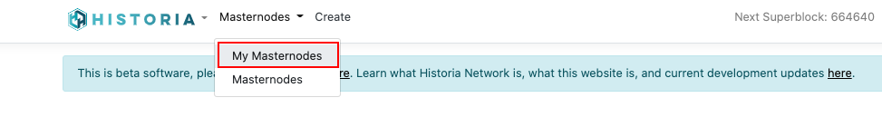
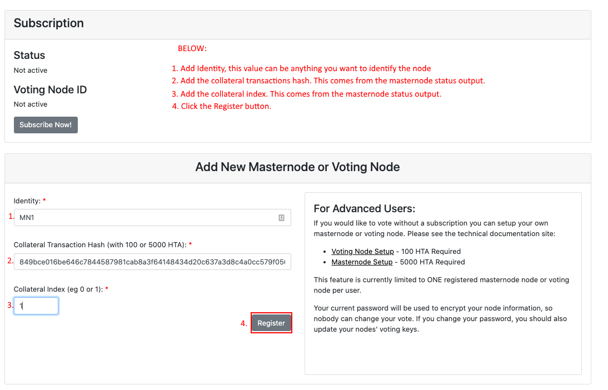
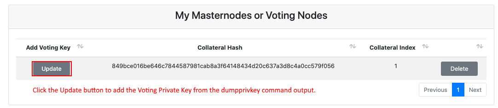

.. meta::
   :description: This guide describes how to set your voting keys on BaseX
   :keywords: historia, guide, voting keys, setup, BaseX

.. _votingnode-setup:

==========================================
Using BaseX
==========================================

Setting up BaseX with your voting keys requires a basic understanding of how to use Historia GUI Wallet and a website.

Before you begin
================

This guide assumes you are setting up your voting keys on BaseX. This assumes that you have already setup your masternode or voting node previously. If you have not setup your masternode or voting node, please do that before you use this guide.

Get Your Voting Private Key
---------------------------

The Historia developers have tried to make this process as simple as possible for the users. On the wallet you have setup your masternode or voting node from, click **Tools > Debug console**. At the console run the following commmand: ::

masternode status

The output will look something like this: ::

{
  "proTxHash": "1656038a406384d508ebee5e1fe1fb48c5560391cd3f6b162f65575fa4c1f95a",
  "collateralHash": "849bce016be646c7844587981cab8a3f64148434d20c637a3d8c4a0cc579f056",
  "collateralIndex": 1,
  "collateralAddress": "HVWWqYBK8bjZHrMXsz88HQxxcteqxPV7Ea",
  "operatorReward": 0,
  "state": {
    "service": "209.250.233.69:10101",
    "registeredHeight": 279634,
    "lastPaidHeight": 298601,
    "PoSePenalty": 0,
    "PoSeRevivedHeight": -1,
    "PoSeBanHeight": -1,
    "revocationReason": 0,
    "ownerAddress": "HPpiVzbXKtqioARFPyijdk2QaJiiFm6Xoy",
    "votingAddress": "HTTM4QbcGiWAWtcJB9g22meoYupHnErcyo",
    "ipfsPeerID": "Qma946d7VCm8v2ny5S2wE7sMFKg9ZqBXkkZbZVVxjJViyu",
    "identity": "mn1.historia.network",
    "payoutAddress": "HPi1Q925T7BjHhWndWTh5w3xvZqw5AZ7oi",
    "pubKeyOperator": "1098e4f499307c4931d6d01438efe811d670226eb1e715e4ed91e78124b32c6dcd636540dc980e0cdc7272d3406ef5cb"
  }
}

Find your **votingAddress**, **collateralHash**, **collateralIndex**. These will be needed to register your masternode in BaseX. In this example it is: ::

    "votingAddress": "HTTM4QbcGiWAWtcJB9g22meoYupHnErcyo",
    "collateralHash": "849bce016be646c7844587981cab8a3f64148434d20c637a3d8c4a0cc579f056",
    "collateralIndex": 1,
    
This next command is important to understand what exactly is happening. Normally you should NEVER run the dumpprivkey command and give the output to a third party. But in the one instance this is safe. There should not be any coins associated with this address. The votingAddress private key is required to use BaseX for voting. During the setup of your private key into BaseX you will encrypt this within the BaseX application and even if the database is hacked, private keys will not be lost.
Alternatively you can just use the HistoriaCore GUI Wallet to vote.

Now in the debug console type in: ::

   HTTM4QbcGiWAWtcJB9g22meoYupHnErcyo

Output: ::

   cSh24QcuT<REMOVE FOR PRIVACY>

Add your voting address private key to BaseX
--------------------------------------------

After you have registered your user on BaseX (https://basex.historia.network/) 

Login to the BaseX application and go to Masternodes->My Masternode.

Login to the BaseX application and go to Masternodes->My Masternode.

Login to the BaseX application and go to Masternodes->My Masternode.

