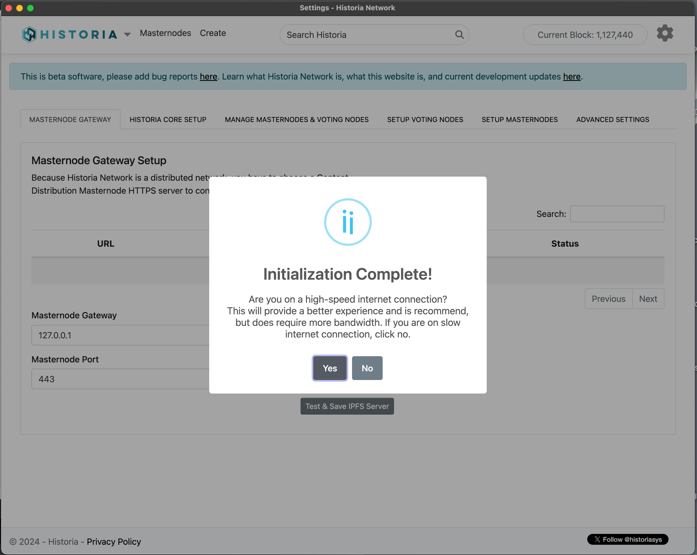
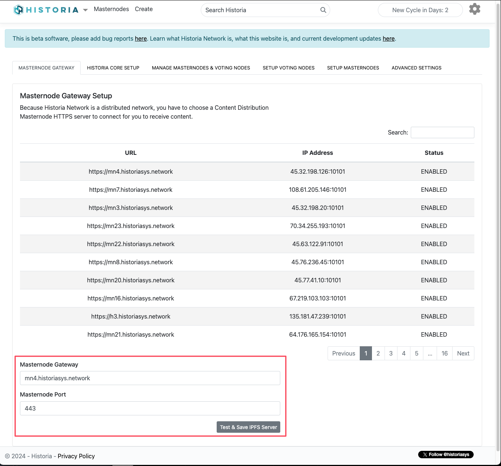
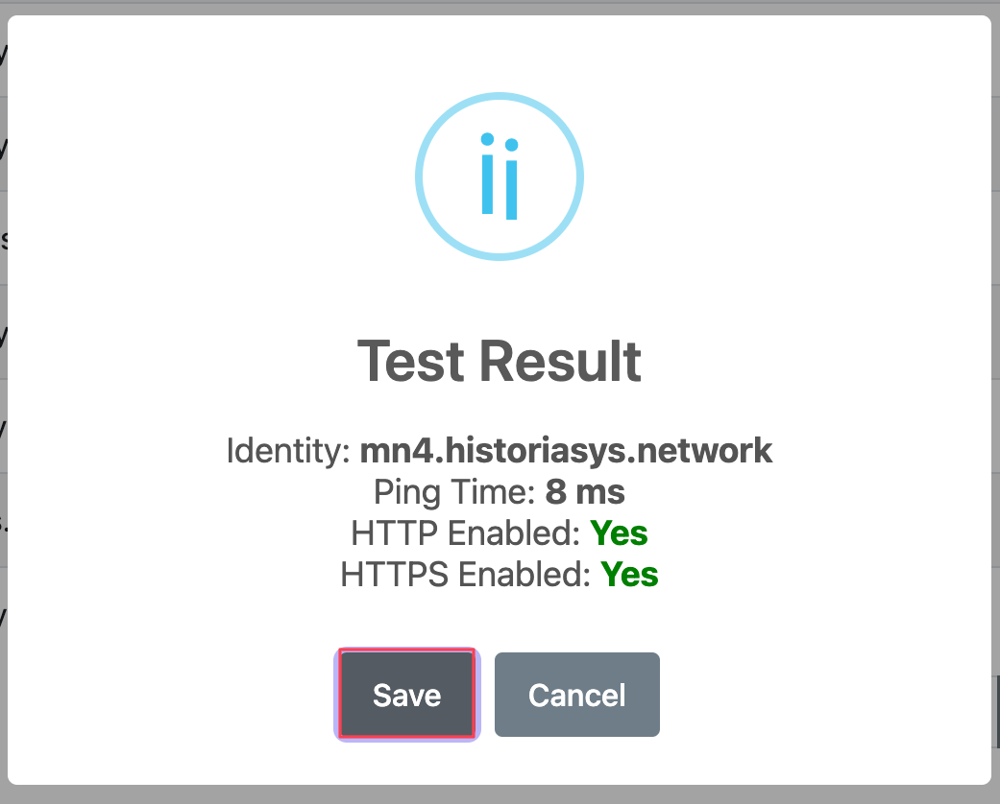
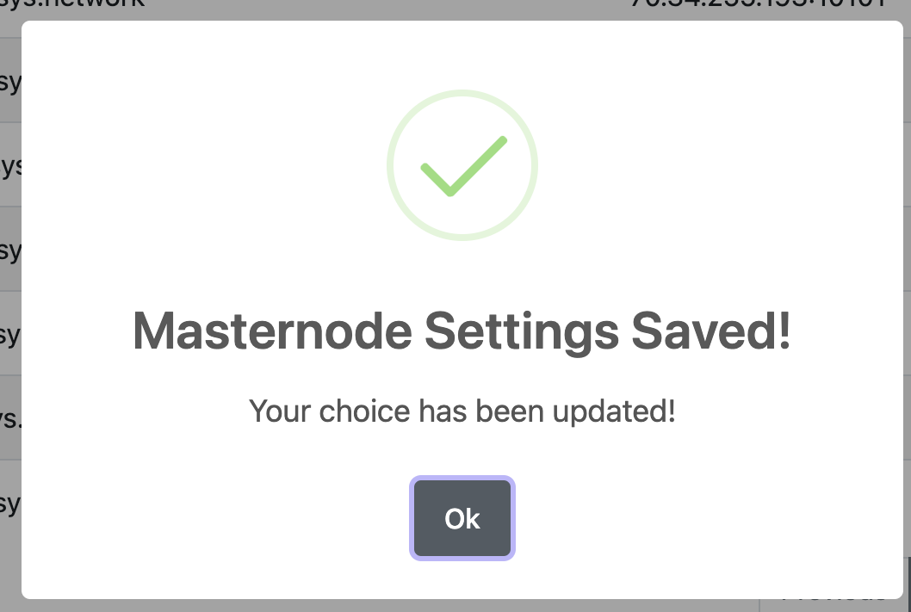
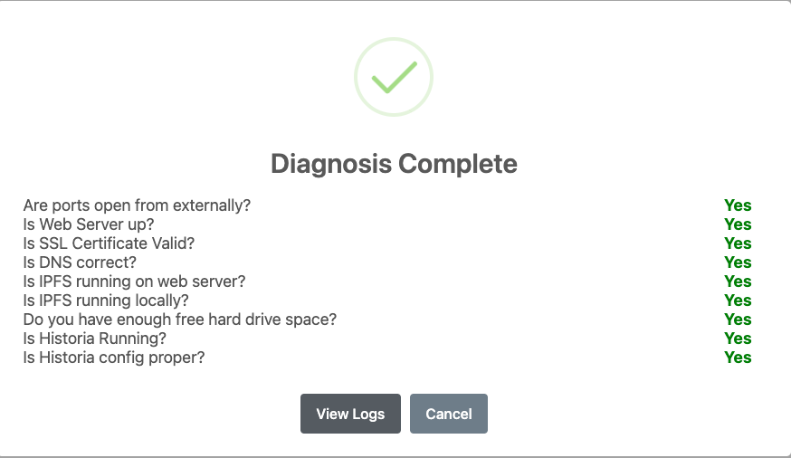

.. meta::
   :description: This guide describes how to set up a Historia masternode. It also describes various options for hosting and different wallets
   :keywords: historia, guide, masternodes, setup,

.. _masternode-setup:

===================================================================
Setup For Linux via Web Interface (Automated)
===================================================================

Setting up a masternode requires a basic understanding of Linux and blockchain technology, as well as an ability to follow instructions closely. It also requires regular maintenance and careful security. There are some decisions to be made along the way, and optional extra steps to take for increased security.

Before you begin
================

This guide assumes you are setting up a single masternode for the first
time. You will need:

- 5000 HTA.
- A wallet to store your Historia, currently only Historia Core wallet is supported.
- A Linux server, preferably a Virtual Private Server (VPS).
- IPv4 address
- Your own DNS name
- Fresh Install of Ubuntu 20.04 VPS (This is a hard requirement)

We also assume you will be working from a Windows computer. However, since most of the work is done on your Ubuntu VPS.

Masternode Info
---------------

- Collateral Requirement: 5000 HTA
- Reward: 50% per block 
- Ports: TCP 10101, TCP 4001, TCP 443, TCP 80
- IPFS Required: Yes
- IPv4 address required
- DNS name
- VPS running Ubuntu 20.04 

In this guide, we will setup a Content Distribution Masternode (CDMN) with collateral of 5000. 

.. _vps-setup:

Encrypt And Backup Your Wallet
==============================

The first step is to secure your wallet (if you have not already done so). 
First, encrypt the wallet by selecting 
**Settings > Encrypt wallet**. You should use a strong, new password
that you have never used somewhere else. Take note of your password and
store it somewhere safe or you will be permanently locked out of your
wallet and lose access to your funds. Next, back up your wallet file by
selecting **File > Backup Wallet**. Save the file to a secure location
physically separate to your computer, since this will be the only way
you can access our funds if anything happens to your computer. If you don't do this, your masternode install will fail.

Set up your VPS
===============

A VPS, more commonly known as a cloud server, is s fully functional installation of an operating system (usually Linux) operating within a virtual machine. The virtual machine allows the VPS provider to run multiple systems on one physical server, making it more efficient and much cheaper than having a single operating system running on the “bare metal” of each server. A VPS is ideal for hosting a Historia masternode because they typically offer guaranteed uptime, redundancy in the case of hardware failure and a static IP address that is required to ensure you remain in the masternode payment queue. While running a masternode from home on a desktop computer is technically possible, it will most likely not work reliably because most ISPs allocate dynamic IP addresses to home users.

We will use Vultr hosting as an example of a VPS. First create an account and add credit. Then go to the Servers menu item on the left and click + to add a new server. 

Select a location for your new server on the following screen:

   Vultr server location selection screen

Select Ubuntu 20.04 x64 as the server type. We use this LTS release of
Ubuntu instead of the latest version because LTS releases are supported
with security updates for 5 years, instead of the usual 9 months.

.. figure:: ../img/Picture2.png
   :width: 400px

   Vultr server type selection screen

Select a server size offering at least 2GB of memory.

   Vultr server size selection screen

Enter a hostname and label for your server. In this example we will use htamn01 as the hostname.

.. figure:: ../img/Picture4.png
   :width: 400px

   Vultr server hostname & label selection screen

Vultr will now install your server. This process may take a few minutes.

.. figure:: ../img/Picture5.png
   :width: 400px

   Vultr server installation screen

Click **Manage** when installation is complete and take note of the IPv4
address, username and password.

   Vultr server management screen

Setup Domain Name System (DNS) A Record
=======================================

Historia requires a DNS name set to enabled SSL for your IPFS node that will be setup below. This is beyond the scope of this document, but there is plenty of documentation online on how to do this. Find a cheap DNS registrar and create a A record that points to the IP address of your VPS. Namecheap.com or GoDaddy.com are options for this. This can be any top level domain, such as .xyz ($0.88 annually) or .fun ($1.00 annually), so get the cheapest domain you can get. 

Remember that if you live in a oppressive country, your name will be associated with your DNS record in the global WHOIS database. Some DNS providers such as ionos.com will give a DNS name privacy for free with domain registration. But they would still be required to hand over your domain name information via court order. Another option is using one of the new blockchain DNS systems such as unstoppabledomains.com, and using crypto currency to purchase your domain name. However we have not tested using a blockchain DNS system yet.

Setup your Masternode via the Historia Local Web application (HLWA)
===================================================================
The Historia Network Core wallet now includes full integration of the Historia Local Web application. This application facilitates the automation of masternode setup, providing all necessary functionality to streamline the process.

In this scenario, we will utilize a Windows 10 desktop machine to store our coins and run the Historia Core Wallet, while an Ubuntu 20.04 LTS VPS will serve as the masternode.

Before you begin, ensure you have downloaded the latest version of the Historia Network Core wallet from the release page on GitHub found here: https://github.com/HistoriaOffical/historia/releases

Verify that the Historia Network Core wallet is fully synced. Once synchronization is complete, navigate to the "Governance" tab. At the bottom of this screen, click the "Open Historia Local Web (HLWA)" button. This will launch the Historia Local Web application. 

.. figure:: ../img/amn1.png
   :width: 600px

   Click the Open Historia Local Web (HLWA)

Preliminary Setup
----------------
If the Historia Local Web application has not been started previously, you will need to complete the preliminary setup as shown in the following screenshots.

   Choose if you are using high-speed internet or not.

.. figure:: ../img/amn3.png
   :width: 300px

   If you choose the High Speed Internet, hit the ok button

.. figure:: ../img/amn4.png
   :width: 300px

   Hit OK and Choose Content Distribution Masternode

   Click on the table to choose a masternode and then hit the "Test & Save IPFS Server"

   This masternode is up and available. Hit the Save button.

   Preliminary Setup is complete, now you can hit the Ok button.

After the preliminary setup is complete, you can now proceed to the Automated Ubuntu 20.04 VPS Setup below.

Automated Ubuntu 20.04 VPS Setup
---------------------------------
After completing the preliminary setup, we have to complete the setup of the Masternode configuration. Navigate to the "Setup Masternodes" tab.

.. figure:: ../img/amn8.png
   :width: 600px

   Setup Masternodes tab. 

Enter your VPS SSH information for your Ubuntu VPS host as indicated below. This will include the SSH Server IP Address, SSH Server Port (default is 22), your DNS name from the previous step that has the A record pointing to the VPS IP Address, Server Username (root user), and the Server Password (password for the root user), As seen below:

   Enter SSH Connection Information 

After you enter in all of the required information, click the "Test Connection" button. The Historia Local Web application will then attempt to connect via SSH to your Ubuntu 20.04 VPS. If your connection is successful, an alert will be popped up saying user is root, and you need to create a new user. Create a new user for your VPS and enter a new password as seen in the screen shot below.

.. figure:: ../img/amn10.png
   :width: 600px

   Create New User for Historia

If it's successfully, you will get a Success message as seen below.

   Successfully created New User for Historia

Then you will see a notification that your Mastenode Has Been Queued for Setup, as seen in the screenshot below.

.. figure:: ../img/amn12.png
   :width: 300px

   Your masternode has been queued for setup.

Once you click on the ok button, it will take you to the setup logs tab, where you can follow the logs of what the Historia Local Web app is doing, as seen below. Your VPS is now being setup to become a masternode. You can now leave this page and go explore records or other areas of the Historia Local Web.

   Setup Logs showing progress.

Masternode Registration
-----------------------
After about 30 minutes or so, come back and check the Settings -> Setup Masternodes -> Setup Logs page, and you will see a new button saying "Unlock Wallet". Once you see this, your masternode has been setup, and the final registration process is ready to start. Click the "Unlock Wallet" button, and enter your wallet password in the prompt.

.. figure:: ../img/amn14.png
   :width: 600px

   Now Unlock your wallet to send masternode registration commands to the Historia Network.

After a few minutes, your masternode should be setup, and you will see two transactions in your wallet transactions to yourself, as seen below.

.. figure:: ../img/amn15.png
   :width: 600px

   Masternode Registration Transactions

If you go to the Manage Masternodes & Voting Nodes, you will see that a new Masternode has been added to the screen. Your masternode has now been setup, and properly registered, and voting keys have been setup ready to vote.

.. figure:: ../img/amn16.png
   :width: 600px

   Your Masternode is now registered, running, and voting keys are setup.

Trouble Shooting
----------------

Install Problems
^^^^^^^^^^^^^^^^
The Historia team has endeavored to simplify the setup process for users. However, due to various factors, issues may occasionally arise. If, upon completing the installation, you do not see your masternode in the Manage Masternodes & Voting Nodes tab, the Historia Core Wallet, or the Masternode listings in HLWA, it indicates an issue has occurred. In such cases, we recommend reinstalling the Ubuntu 20.04 node and starting the process anew. Future updates will aim to enhance this process, allowing the Historia Local Web to automatically address any installation issues, reducing the need for a complete reinstall. 

Before starting over, reach out to us in Discord or Telegram, send us your log files from the Setup Log tab in the Historia Local Web, and let us try to figure out your problem. Alternatively you can submit a bug report here:
https://github.com/HistoriaOffical/Historia-Local-Web-Application/issues

If submitting bug reports, please provide the log files mentioned above, as well as much info as you can provide about your setup.

POSE_BANNED State
^^^^^^^^^^^^^^^^^
If your masternode is in the POSE_BANNED state, you will no longer receive rewards for running it. In the Historia Local Web app, the Manage Masternodes & Voting Nodes tab offers several action functions to help diagnose and resolve the issue.

In the actions area, you will find several icons. Hover over each icon for information about its function. The functions for masternodes, from left to right, are as follows:

- Information: Displays your node's information and allows you to update certain details.
- Diagnose: Attempts to identify potential problems with your masternode.
- Restart Masternode: Sends a request to the network to restart your masternode and attempt to resolve the POSE_BANNED state.
- Revoke Masternode: Allows you to stop running a masternode, unlocking your coins so you can move them.

   Actions Menu

The following screen shot is from the Masternode Information action. As you can see you have all of the information about your masternode. You can also update certain fields such as the Fee Source Address, BLS Private Key, BLS Public Key. If you setup your Masternode using the Historia Local Web app, then these fields will already be filled for you. If you set them up using some other manner, then you will have to add these values before you can Restart or Revoke your masternode

   Masternode Information Dialog

The following screen shot is from the Diagnosis Tools action. First you need to enter in your username and password of the server. This is not the root user, but rather the username that historia is running under.

   Diagnosis Tools Dialog

After you enter in your username and password, click the Test Connection button. If the connection is successful, you will next see this screen. Click Run Diagnosis button.

   Run Diagnosis Dialog

Historia Local Web will attempt to diagnose common issues that your masternode might have. In this screen shot below, all issues have been resolved. You can also view the logs for further information.

   Diagnosis Complete Dialog

After you have solved any potential issues, you can attempt to the Restart Masternode action. You have to enter your wallet passphrase to restart your masternode. If you setup your Masternode using the Historia Local Web app, then all information to restart is already ready to attempt to restart. If you set them up using some other manner, then you will have to add Fee Source Address, BLS Private Key, BLS Public Key in the Information Action.

   Restart Masternode Dialog

After you click the Attempt to Restart button, you should see this dialog. If something went wrong, you will receive a different error message.

   Restart Masternode Confirmation Dialog

Revoke Masternode
^^^^^^^^^^^^^^^^^
If you no longer want to run a masternode and have the ability to move your coins. Click the Revoke Masternode action, and enter your wallet passphrase.

   Revoke Masternode Confirmation Dialog
