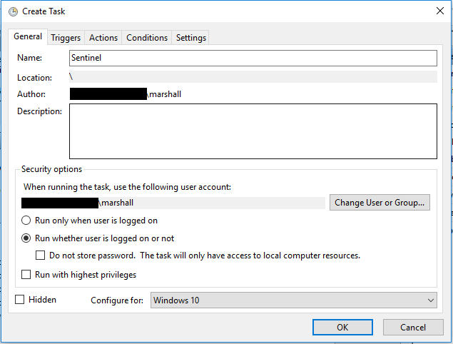
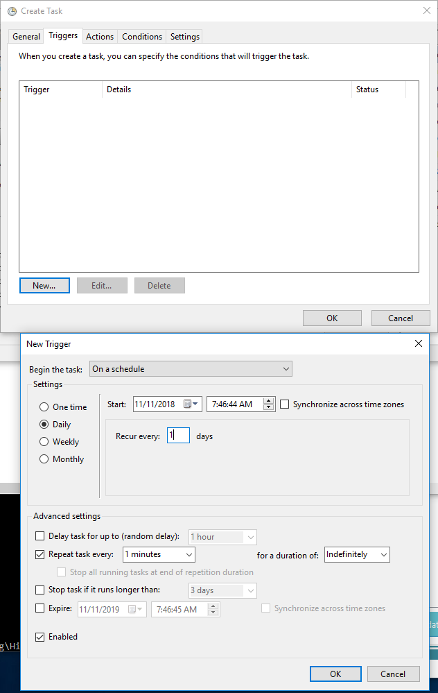
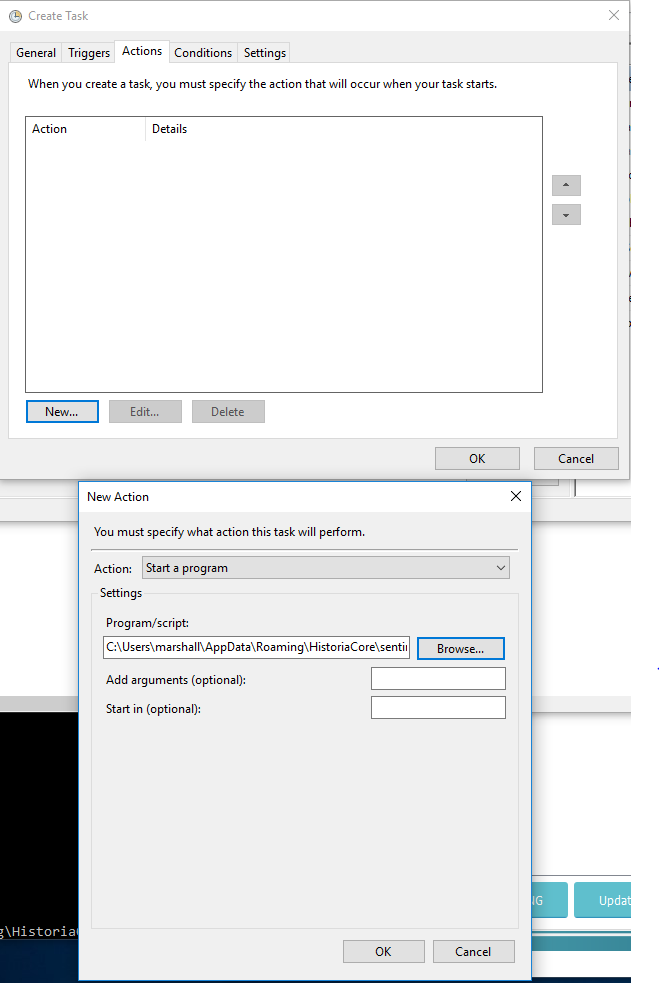
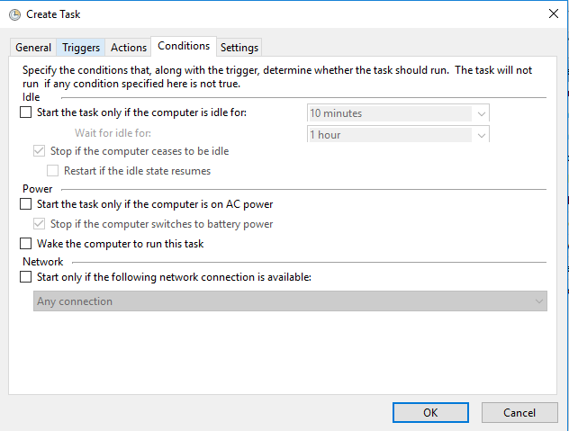
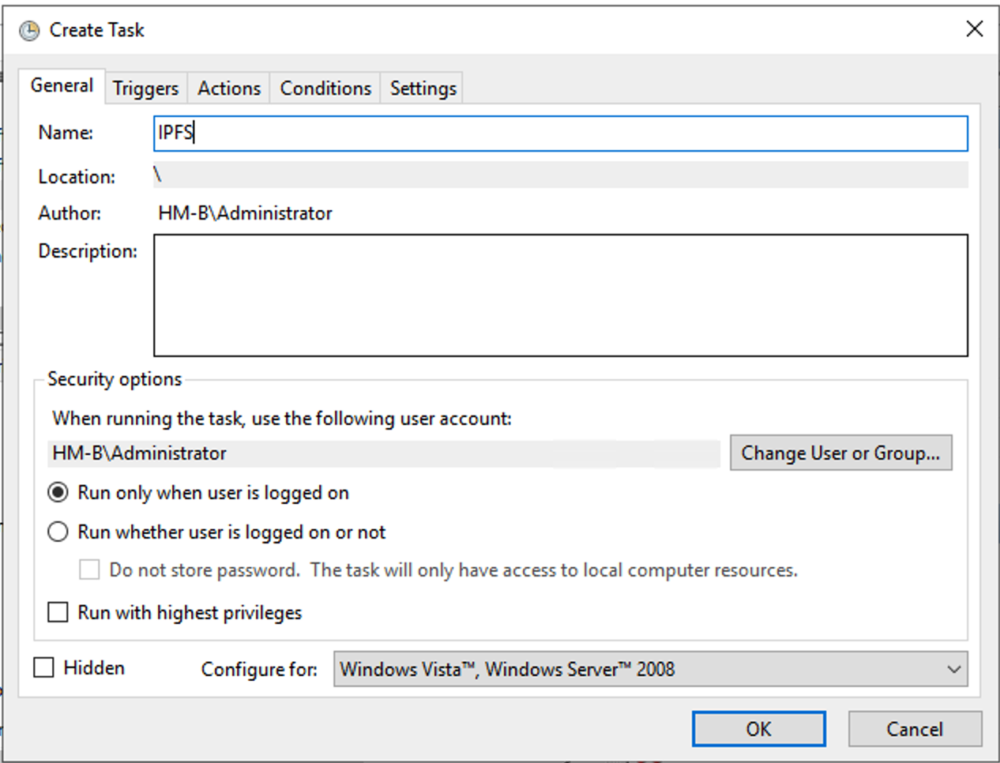
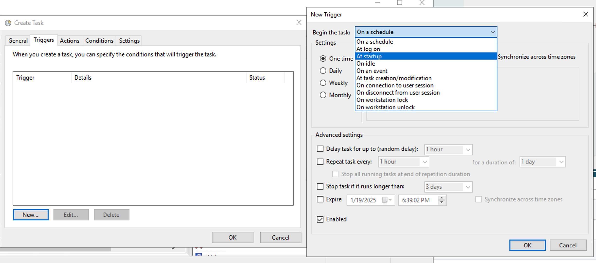
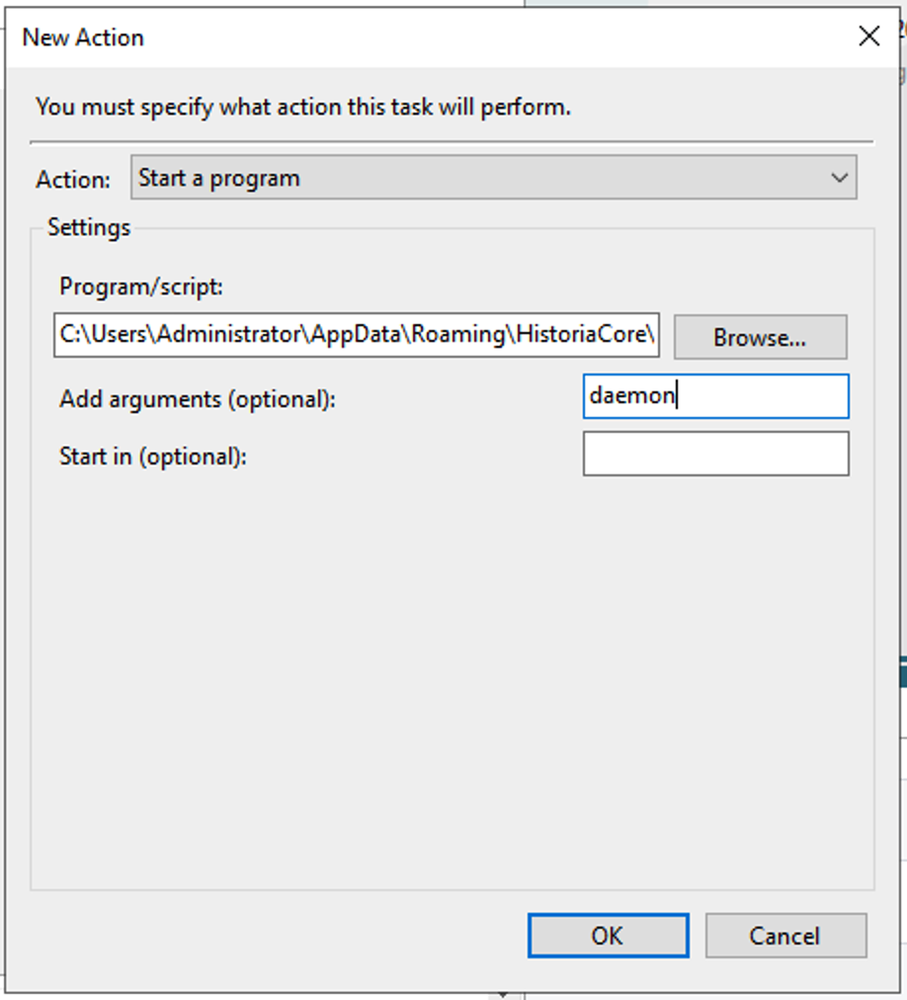
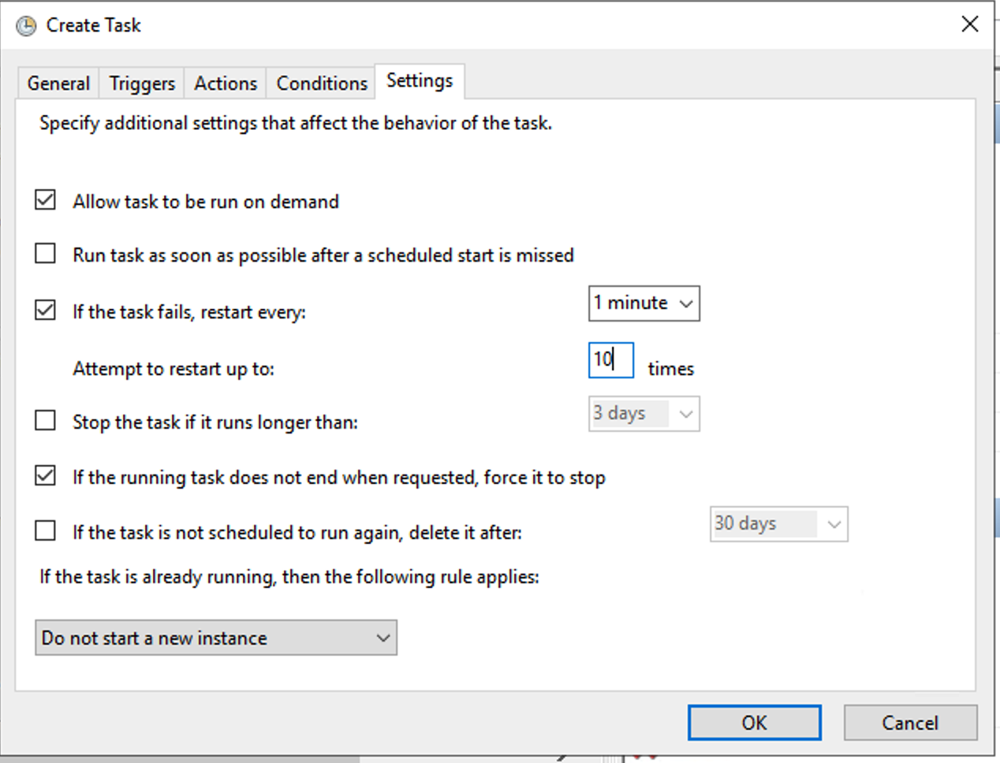

.. meta::
   :description: This guide describes how to set up a Historia masternode. It also describes various options for hosting and different wallets
   :keywords: historia, guide, masternodes, setup,

.. _masternode-setup:

=====================================================================
Setup For Windows
=====================================================================

Setting up a masternode requires a basic understanding of Windows and blockchain technology, as well as an ability to follow instructions closely. It also requires regular maintenance and careful security. There are some decisions to be made along the way, and optional extra steps to take for increased security.

Before you begin
================

This guide assumes you are setting up a single masternode for the first
time. You will need:

- 5000 HTA 
- A wallet to store your Historia, currently only Historia Core wallet is supported
- A Windows 10 or Windows Server instance. [Can be a PC or VPS]
- Static IPv4 address
- Your own DNS name

If you are setting up from your own home network, ports need to be publicly open on the Internet. This normally requires Port Forwarding on your router, which is out of scope for this document. Use your favorite search engine to research Port Forwarding.

Masternode Info
---------------

- Collateral Requirement: 5000 HTA
- Reward: 50% per block
- Ports: TCP 10101, TCP 4001, TCP 443, TCP 80 (Home network would require port forwarding)
- IIS or any SSL supported Webserver
- IPFS Required: Yes
- Static IPv4 address required
- Your own DNS name

In this guide, we will setup a Content Distribution Masternode (CDMN) with collateral of 5000. 

Set up your VPS 
===============================
**If you are setting this up on your home network you can skip this step**

A VPS, more commonly known as a cloud server, is fully functional installation of an operating system operating within a virtual machine. The virtual machine allows the VPS provider to run multiple systems on one physical server, making it more efficient and much cheaper than having a single operating system running on the “bare metal” of each server. A VPS is ideal for hosting a Historia masternode because they typically offer guaranteed uptime, redundancy in the case of hardware failure and a static IP address that is required to ensure you remain in the masternode payment queue. While running a masternode from home on a desktop computer is technically possible, it will most likely not work reliably because most ISPs allocate dynamic IP addresses to home users.
We will use Vultr hosting as an example of a VPS. First create an account and add credit. Then go to the Servers menu item on the left and click + to add a new server. 

Select a location for your new server on the following screen.

.. figure:: /masternodes/img/server-location.png
   
Select Windows as the server type.

.. figure:: /masternodes/img/server-type1.png
   
Select a server size offering at least 2GB of memory.

.. figure:: /masternodes/img/server-type2.png
   
Enter a hostname and label for your server. In this example we will use htamn01 as the hostname.

.. figure:: /masternodes/img/server-name.png
   
Add IPv6 for your server. IPv6 isn’t required but nice to have.

.. figure:: /masternodes/img/server-ipv6.png
   
Vultr will now install your server. This process may take a few minutes.

.. figure:: /masternodes/img/server-location.png
   
Click Manage when installation is complete and take note of the IPv4 address, username and password.

.. figure:: /masternodes/img/server-management.png

Setup Firewall 
===============================
To make communication possible you need to allow following TCP ports through your firewall.
**If you are setting this up on your home network you must also setup port forwarding for the required ports**

.. figure:: /masternodes/img/firewall-1-2-3.png
   
.. figure:: /masternodes/img/firewall-4-5.png
   
.. figure:: /masternodes/img/firewall-6-7.png
   
.. figure:: /masternodes/img/firewall-8-9.png
   

Setup Domain Name System (DNS) A Record
===============================
Historia requires a DNS name set to enabled SSL for your IPFS node that will be setup below. This is beyond the scope of this document, but there is plenty of documentation online on how to do this. Find a cheap DNS registrar and create a A record that points to the IP address of your VPS. Namecheap.com or GoDaddy.com are options for this. This can be any top level domain, such as .xyz ($0.88 annually) or .fun ($1.00 annually), so get this cheapest domain you can get.
Remember that if you live in a oppressive country, your name will be associated with your DNS record in the global WHOIS database. Some DNS providers such as ionos.com will give a DNS name privacy for free with domain registration. But they would still be required to hand over your domain name information via court order. Another option is using one of the new blockchain DNS systems such as unstoppabledomains.com and using crypto currency to purchase your domain name. However we have not tested using a blockchain DNS system yet. If you can't afford or do not have the expertise to setup a DNS name, email us at info@historia.network with a subject line of "DNS Request", and we will set you up with a DNS name for your Masternode.

Option 1: A Record – NS Zone
----------------
.. figure:: /masternodes/img/Domain-NS_Zone.png

Option 2: Child Name – Domain Panel
----------------
.. figure:: /masternodes/img/Domain-child.png

Install Historia Windows Wallet
===============================
You MUST use Historia 0.17.1.0 or later, otherwise this process will fail. https://github.com/HistoriaOffical/historia/releases/

Download the correct Windows Historia setup file from the previous URL. Once downloaded, run the Historia installer and install the Historia wallet. Open the wallet and let the blockchain sync completely.

Send the collateral
===================

A Historia address with a single unspent transaction output (UTXO) of exactly 5000 HTA is required to operate a Voting Masternode. 
Once it has been sent, various keys regarding the transaction must be extracted for later entry in a configuration file. 
A masternode can be started from the official Historia Core wallet. This guide will describe the steps for Historia Core.

Option 1: Sending from Historia Core wallet
-------------------------------------------

Open Historia Core wallet and wait for it to synchronize with the network.
It should look like this when ready:

.. figure:: /img/Picture10.png

   Fully synchronized Historia Core wallet

Click **Tools > Debug console** to open the console. Type the following
two commands into the console to generate a new Historia address for the collateral::

  getnewaddress
  HBvcjyzWmt9x9QJNVDyxezhxSXcWEDEdsS

Take note of the masternode private key and collateral address,
since we will need it later. The next step is to secure your wallet (if
you have not already done so). First, encrypt the wallet by selecting
**Settings > Encrypt wallet**. You should use a strong, new password
that you have never used somewhere else. Take note of your password and
store it somewhere safe or you will be permanently locked out of your
wallet and lose access to your funds. Next, back up your wallet file by
selecting **File > Backup Wallet**. Save the file to a secure location
physically separate to your computer, since this will be the only way
you can access our funds if anything happens to your computer.

Content Distribution Masternode (CDMN) - Collateral 5000
^^^^^^^^^^^^^^^^^^^^^^^^^^^^^^^^^^^^^^^^^^^^^^^^^^^^^^^^
If setting up a Content Distribution Masternode (CDMN), send exactly 5000 HTA in a single transaction to the new address
you generated in the previous step. This may be sent from another
wallet, or from funds already held in your current wallet. 

Check Transaction
-----------------
Once the transaction is complete, view the transaction in a `blockchain explorer
<http://blockexplorer.historia.network/>`_ by searching for the address. You
will need 15 confirmations before you can start the masternode, but you
can continue with the next step at this point already: installing Historia
Core on your VPS.

.. _masternode-setup-install-historiacore:

Next, setup the historia.conf files by selecting Tools > Open Wallet Configuration File.

A text editor window will appear. We now need to create a configuration file specifying several variables. Copy and paste the following text into the Wallet Configuration file, then replace the variables specific to your configuration as follows::

  #----
  rpcuser=XXXXXXXXXXXXX
  rpcpassword=XXXXXXXXXXXXXXXXXXXXXXXXXXXX
  rpcallowip=127.0.0.1
  #----
  listen=1
  server=1
  daemon=1
  #----
  #masternode=1
  #masternodeblsprivkey=
  #masternodecollateral=5000
  #masternodedns=<yourdnsname>
  externalip=XXX.XXX.XXX.XXX:10101
  #----

Replace the fields marked with ``XXXXXXX`` as follows:

- ``rpcuser``: enter any string of numbers or letters, no special
  characters allowed
- ``rpcpassword``: enter any string of numbers or letters, no special
  characters allowed
- ``masternodecollateral``: 100 or 5000 depending on if you are setting up a Voting Masternode or Content Distribution Masternode. For this guide set this to 5000.
- ``masternodedns``: The DNS name you previously registered.
- ``externalip``: this is the IPv4 address of your VPS

Save the historia.conf file in the default location and exit the text editor.::

   C:\Users\<yourusername>\AppData\Roaming\HistoriaCore\ 

Setup IPFS
================
Option 1: Use prebuild package
-----------------
Download version v0.4.23. It should be noted that currently the newest version that works is v0.4.23. If you are running a version newer that v0.4.23 this process will fail::

   https://dist.ipfs.tech/go-ipfs/v0.4.23

After downloading, unzip and copy the kubo directory into your HistoriaCore directory (C:\\Users\\<yourusername>\\AppData\\Roaming\\HistoriaCore\\)   as seen below.

.. figure:: ../img/kubo.png

Initialize IPFS Daemon for Historia
-----------------
Since we will be using IPFS only for Historia, we can safely run the initialization: 
(Run commands on Windows Command Prompt as Admin) ::

   cd C:\Users\<yourusername>\AppData\Roaming\HistoriaCore\Kubo\
   ipfs init

Add Bootstap IPFS Nodes and Connect to Historia IPFS Swarm
-----------------
Add Historia IPFS bootstrap nodes, configure our IPFS node, and only connect to the Historia IPFS Swarm.  ::

   ipfs bootstrap add /ip4/202.182.119.4/tcp/4001/ipfs/QmVjkn7yEqb3LTLCpnndHgzczPAPAxxpJ25mNwuuaBtFJD
   ipfs bootstrap add /ip4/149.28.22.65/tcp/4001/ipfs/QmZkRv4qfXvtHot37STR8rJxKg5cDKFnkF5EMh2oP6iBVU
   ipfs bootstrap add /ip4/149.28.247.81/tcp/4001/ipfs/QmcvrQ8LpuMqtjktwXRb7Mm6JMCqVdGz6K7VyQynvWRopH
   ipfs bootstrap add /ip4/45.32.194.49/tcp/4001/ipfs/QmZXbb5gRMrpBVe79d8hxPjMFJYDDo9kxFZvdb7b2UYamj
   ipfs bootstrap add /ip4/45.76.236.45/tcp/4001/ipfs/QmeW8VxxZjhZnjvZmyBqk7TkRxrRgm6aJ1r7JQ51ownAwy
   ipfs bootstrap add /ip4/209.250.233.69/tcp/4001/ipfs/Qma946d7VCm8v2ny5S2wE7sMFKg9ZqBXkkZbZVVxjJViyu
   ipfs config --json Datastore.StorageMax "\"50GB\""
   ipfs config --json Gateway.HTTPHeaders.Access-Control-Allow-Headers "[\"X-Requested-With\", \"Access-Control-Expose-Headers\", \"Range\", \"Authorization\"]"
   ipfs config --json Gateway.HTTPHeaders.Access-Control-Allow-Methods "[\"POST\", \"GET\"]"
   ipfs config --json Gateway.HTTPHeaders.Access-Control-Allow-Origin "[\"*\"]"
   ipfs config --json Gateway.HTTPHeaders.Access-Control-Expose-Headers "[\"Location\", \"Ipfs-Hash\"]"
   ipfs config --json Gateway.HTTPHeaders.X-Special-Header "[\"Access-Control-Expose-Headers: Ipfs-Hash\"]"
   ipfs config --json Gateway.NoFetch "false"
   ipfs config --json Swarm.ConnMgr.HighWater "500"
   ipfs config --json Swarm.ConnMgr.LowWater "200"

If the commands did not work you have to do these manually by edit config file at C:\\Users\\<YOURUSERNAME>\\.ipfs\\config  and add or edit parameters. 
Change your ipfs configuration file to look something like this. It should be noted that this is not the entire IPFS file, but the areas that need to be changed: ::

   ...snipped...
    "StorageMax": "50GB"
  },
  "Discovery": {
    "MDNS": {
      "Enabled": false,
      "Interval": 10
    }
  },
  "Experimental": {
    "FilestoreEnabled": false,
    "Libp2pStreamMounting": false,
    "P2pHttpProxy": false,
    "PreferTLS": false,
    "QUIC": false,
    "ShardingEnabled": false,
    "UrlstoreEnabled": false
  },
  "Gateway": {
    "APICommands": [],
    "HTTPHeaders": {
      "Access-Control-Allow-Headers": [
        "X-Requested-With",
        "Access-Control-Expose-Headers",
        "Range",
        "Authorization"
      ],
      "Access-Control-Allow-Methods": [
        "POST",
        "GET"
      ],
      "Access-Control-Allow-Origin": [
        "*"
      ],
      "Access-Control-Expose-Headers": [
        "Location",
        "Ipfs-Hash"
      ],
      "X-Special-Header": [
        "Access-Control-Expose-Headers: Ipfs-Hash"
      ]
    },
    "NoFetch": false,
    "PathPrefixes": [],
    "RootRedirect": "",
    "Writable": false
   ...snipped...

Now when you start IPFS, the IPFS daemon will now connect to the Historia IPFS swarm when started. ::

  ipfs daemon

If you see an error message such as::

   E:\HistoriaCore\kubo> .\ipfs.exe daemon
   Initializing daemon...
   go-ipfs version: 0.4.23-
   Repo version: 7
   System version: amd64/windows
   Golang version: go1.13.7

   Error: Your programs version (7) is lower than your repos (15).
   Please update ipfs to a version that supports the existing repo, or run
   a migration in reverse.

Do the following:

- Kill (Ctrl-C) the IPFS daemon
- Delete the .ipfs directory (C:\\Users\\<YOURUSERNAME>\\\.ipfs\)
- Run "ipfs.exe init" again
- Run "ipfs.exe daemon" again and see if that clears up the error

Get IPFS Peer ID
-----------------
Historia needs the IPFS ID generated by the IPFS initialization command in masternode registration command below. Run this command and save the ID value for later:  ::

   ipfs id
   
Result : ::

    {
   **"ID": "QmVjkn7yEqb3LTLCpnndHgzczPAPAxxpJ25mNwuuaBtFJD",** // THIS IS YOUR IPFS PEER ID, HISTORIA WILL NEED THIS
   "PublicKey": "CAASpgIwggEiMA0GCSqGSIb3DQEBAQUAA4IBDwAwggEKAoIBAQDGKc55NxrimIWjWIFK6J9Kgj0caCwzGbNCZ4xphSww4j3gsPe1puLhkQHoQpvB7BeDXMdsuIFEfknBjHsZTxRM66X/ZhODyv+wwuQs92FJ2Lb6n/HB/fqsjvkPYQeSNe+T1Djjc2OYzuZkTZwCNrY9hGUEbEq6O1DeqMHWRN1Gy0fu31QyL6mjVq804udm0sQlO3Cey8hmChTBH+GCw1sTNlUlEQy88FPMSjq6j/qGfHRO1bA/trYLTsjIEMLI+xi/HtVzrOg6n+/kQopjWLCGy19IXn/ZVzOZuJhpqBYAkVnUd1b9na5ND/3iN5VTdO6biK+NQ8hH/DEi4sb8wMqpAgMBAAE=",
   "Addresses": [
      "/ip4/127.0.0.1/tcp/4001/ipfs/QmVjkn7yEqb3LTLCpnndHgzczPAPAxxpJ25mNwuuaBtFJD",
      "/ip4/<youripv4address>/tcp/4001/ipfs/QmVjkn7yEqb3LTLCpnndHgzczPAPAxxpJ25mNwuuaBtFJD",
   ],
   "AgentVersion": "go-ipfs/0.4.23/8ca278f45",
   "ProtocolVersion": "ipfs/0.1.0"
   }

Check IPFS is connected to Historia Swarm
-----------------
To verify that IPFS is connect to the correct swarm:  ::

   ipfs swarm peers
   
Output ::

   /ip4/149.28.22.65/tcp/4001/ipfs/QmZkRv4qfXvtHot37STR8rJxKg5cDKFnkF5EMh2oP6iBVU
   /ip4/149.28.247.81/tcp/4001/ipfs/QmcvrQ8LpuMqtjktwXRb7Mm6JMCqVdGz6K7VyQynvWRopH
   /ip4/202.182.119.4/tcp/4001/ipfs/QmVjkn7yEqb3LTLCpnndHgzczPAPAxxpJ25mNwuuaBtFJD
   /ip4/45.32.194.49/tcp/4001/ipfs/QmZXbb5gRMrpBVe79d8hxPjMFJYDDo9kxFZvdb7b2UYamj
   /ip4/45.76.236.45/tcp/4001/ipfs/QmeW8VxxZjhZnjvZmyBqk7TkRxrRgm6aJ1r7JQ51ownAwy
   
It would be good see at least these peers to verify you are connected to the Historia IPFS swarm. It's ok if you don't see these peers, Historia Core will eventually find them.

After you have tested the IPFS daemon, you can kill the daemon and close the command line window. We will setup IPFS to run on start up at the end of this document.

Setup IIS in Windows, SSL Certificate, and point to IPFS
========================================================
Because this is a content distribution masternode, you must setup IIS web server with a valid SSL certificate in a reverse proxy setup to properly point to IPFS. 

Install IIS
-----------
First step in this process is to install IIS. Instead of walking through that process here, we will point you to this installation procedure: https://community.lansweeper.com/t5/installation/install-iis-internet-information-services/ta-p/64422#:~:text=Enable%20Internet%20Information%20Services%20(IIS,Services%20checkbox%20and%20select%20OK.

Create Binding in IIS
---------------------
To properly setup the SSL certificate you must create a binding in IIS for your DNS A record that should already be setup and pointed at your public IP address at this point. We are assuming you are using the "Default Web Site" for this example.

- Open Run Command using the shortcut Win Key + R.
- Type in 'inetmgr'.
- Select and run the Internet Information Services (IIS) Manager.
- Expand the left pane and select the "Default Web Site".
- On the right pane, under Edit Site, click on "Bindings".
- After the Site Bindings dialog box opens, click the "Add" button.
- Leave everything default and add your DNS A record name in the Host Name box. An example would be testwinmn.historia.network
- Click Ok, then click close.
- On left hand pane, under the Manage Website section, click Restart

Setup SSL Certificate for IIS
------------------------------
To setup the SSL certicate we are going to be using a free utility called Win-Acme, https://www.win-acme.com/ which uses the Let's Encrypt SSL certificate authority to issue a valid SSL certificate for free.

- Goto https://www.win-acme.com/, and download the latest version
- Extract the zip file into your C:\\Program Files\\  into a new folder called Win-acme
- Find the wacs.exe file in the new folder and right click on the file and select "Run as Administrator".
- Win-acme will start
- Choose: N: Create new certificate (simple for IIS)
- Choose: 1: Default Web Site (1 binding)
- Choose: 3: Pick all bindings
- Choose: Continue with this selection? (y*/n)  - yes

If all goes well you will have a new SSL certificate installed in IIS for your Default Site. If the Create certicate failed, check the following things:

- Is Your firewall is blocking port 80 and port 443?
- Did you use the correct DNS name when setting up IIS?

Setup Reverse Proxy from IIS to IPFS
------------------------------------
Depending on your setup, you may need to install additional Microsoft IIS modules

- Confirm it's installed or install the Windows URL rewrite module. It can be downloaded from https://www.iis.net/downloads/microsoft/url-rewrite
- Confirm it's installed or install Application Request Routing (ARR). It can be downloaded from https://www.iis.net/downloads/microsoft/application-request-routing
- Restart IIS service or stop and start from left hand side panel
- Open Run Command using the shortcut Win Key + R.
- Type in 'inetmgr'.
- Select and run the Internet Information Services (IIS) Manager.
- Expand the left pane and select the "Default Web Site".
- In the main pane in the middle, select the URL Rewrite module.
- After the URL Rewrite module has opened, on the left hand pane, select "Add Rule(s)"...
- After the "Add Rule(s)" dialog box opens, click on the "Reverse Proxy" and click OK.
- In the "Enter the server name of the IP address where the HTTP requests will be forwarded:" box, point to your IPFS server: 127.0.0.1:8080
- Leave all other options default values.
- Click Ok
- On the left pane and select the "Default Web Site", again.
- On right pane, under Manage Website, select Restart.

Congratulations! You now have finished setup for IPFS. You can now test out the IPFS Nginx proxy combination by opening the following in your browser: ::

   https://<yourdomainname>/ipfs/QmS4ustL54uo8FzR9455qaxZwuMiUhyvMcX9Ba8nUH4uVv/readme

If you see the IPFS help message, you have successful setup your IPFS server with IIS in a reverse proxy configuration with a valid SSL certifcate. 

If you do not see the IPFS help message, you must go back over all steps and get this properly working before you can continue to setup your Historia masternode.

Check the following things:

- Is Your firewall is blocking port 4001?
- Are you running the correct version of IPFS v0.4.23?
- Did you restart IIS after all changes have been made?

If everything is good, you can now proceed to installing your Historia masternode. Continue with the next step to construct the ProTx transaction required to enable your masternode.

Register your masternode
========================
Identify the funding transaction
--------------------------------
If you used an address in Historia Core wallet for your collateral transaction, you now need to find the txid of the transaction. 
Click **Tools > Debug console** and enter the following command: ::

   masternode outputs

This should return a string of characters similar to the following: ::

   {
   "16347a28f4e5edf39f4dceac60e2327931a25fdee1fb4b94b63eeacf0d5879e3" : "1",
   }

The first long string is your **collateralHash**, while the last number is the **collateralIndex**.

Generate a BLS key pair
-----------------
A public/private BLS key pair is required to operate a masternode. The private key is specified on the masternode itself, and allows it to be included in the deterministic masternode list once a provider registration transaction with the corresponding public key has been created.
If you are using a hosting service, they may provide you with their public key, and you can skip this step. If you are hosting your own masternode or have agreed to provide your host with the BLS private key, generate a BLS public/private keypair in Historia Core by clicking **Tools > Debug console** and entering the following command: ::

   bls generate
   
   {
   "secret": "395555d67d884364f9e37e7e1b29536519b74af2e5ff7b62122e62c2fffab35e",
   "public": "99f20ed1538e28259ff80044982372519a2e6e4cdedb01c96f8f22e755b2b3124fbeebdf6de3587189cf44b3c6e7670e"
   }

**These keys are NOT stored by the wallet and must be kept secure, similar to the value provided in the past by the** masternode genkey **command**.

Add the private key to your masternode configuration
----------------------------------------------------
The public key will be used in following steps. The private key must be entered in the **historia.conf** file on the masternode. This allows the masternode to watch the blockchain for relevant Pro*Tx transactions, and will cause it to start serving as a masternode when the signed ProRegTx is broadcast by the owner (final step below). Edit the configuration file: ::

   C:\Users\<yourusername>\AppData\Roaming\HistoriaCore\historia.conf

The editor appears with the existing masternode configuration. Add or uncomment these lines in the file, replacing the key with your BLS private key generated above, and adding your DNS "A" record::

 masternode=1
 masternodecollateral=5000
 masternodeblsprivkey=395555d67d884364f9e37e7e1b29536519b74af2e5ff7b62122e62c2fffab35e
masternodedns=<yourdnsname>

Press enter to make sure there is a blank line at the end of the file, then save and close the editor. We now need to restart the Historia Core for this change to take effect. Close Historia Core and run it again. 

We will now prepare the transaction used to register the masternode on the network.

Prepare a ProRegTx transaction
-----------------
A pair of BLS keys for the operator were already generated above, and the private key was entered on the masternode. The public key is used in this transaction as the **operatorPubKey**.
First, we need to get a new, unused address from the wallet to serve as the **owner key address (ownerKeyAddr)**. This is not the same as the collateral address holding 5000 Historia. Generate a new address in Historia Core by clicking **Tools > Debug console** and entering the following command: ::

 getnewaddress
 
 HTGfMbCy2X65th3L78JVyqpzhu6p1fbSC6

Next generate your a **voting key address (votingKeyAddr)**. Simply generate a new voting key address as follows: ::

   getnewaddress
   
   HDsy8GUnsdFKWrRHB8WbD4oaLvETDZ9scY

Then generate **owner’s masternode payouts (payoutAddress)**. It is also possible to use an address external to the wallet: ::

   getnewaddress
   
   HEAjS5DJ9cjprZvk3t1eeq7jn2dhZztfDJ
   
Then generate **transaction fee source (feeSourceAddress)**. Then fee source address must have enough balance to pay the transaction fee, so send a few coins here, or the final register_submit transaction will fail.: ::

   getnewaddress
   
   HQyqm7srzV7nYhGLjuzTzjBs452suStCQW
   
The private keys to the owner and fee source addresses must exist in the wallet submitting the transaction to the network. If your wallet is protected by a password, it must now be unlocked to perform the following commands. Unlock your wallet for 5 minutes: ::

   walletpassphrase yourSecretPassword 300

Send some coins to your **transaction fee source (feeSourceAddress)**. ::
   
   sendtoaddress HQyqm7srzV7nYhGLjuzTzjBs452suStCQW 2
   
We will now prepare an unsigned ProRegTx special transaction using the protx register_prepare command. This command has the following syntax: ::

   protx register_prepare collateralHash collateralIndex ipAndPort ownerKeyAddr
   operatorPubKey votingKeyAddr operatorReward payoutAddress ipfsPeerId identity (feeSourceAddress)

Open a text editor such as notepad to prepare this command. Replace each argument to the command as follows:
         - **collateralHash**: The txid of the 5000 Historia collateral funding transaction
         - **collateralIndex**: The output index of the 5000 Historia funding transaction
         - **ipAndPort**: Masternode IP address and port, in the format x.x.x.x:yyyy
         - **ownerKeyAddr**: The new Historia address generated above for the owner/voting address
         - **operatorPubKey**: The BLS public key generated above (or provided by your hosting service)
         - **votingKeyAddr**: The new Historia address generated above, or the address of a delegate, used for proposal voting
         - **operatorReward**: The percentage of the block reward allocated to the operator as payment
         - **payoutAddress**: A new or existing Historia address to receive the owner’s masternode rewards
         - **ipfsPeerId**: The public IPFS ID of your IPFS daemon required from the above IPFS setup.
         - **identity**: This is the domain name that you previously have registered and tested above https://<yourdomainname>/ipfs/QmS4ustL54uo8FzR9455qaxZwuMiUhyvMcX9Ba8nUH4uVv/readme
         - **feeSourceAddress**: An (optional) address used to fund ProTx fee. payoutAddress will be used if not specified.

Example (remove line breaks if copying): ::

   protx register_prepare
   16347a28f4e5edf39f4dceac60e2327931a25fdee1fb4b94b63eeacf0d5879e3
   1
   45.76.230.239:19999
   HTGfMbCy2X65th3L78JVyqpzhu6p1fbSC6
   99f20ed1538e28259ff80044982372519a2e6e4cdedb01c96f8f22e755b2b3124fbeebdf6de3587189cf44b3c6e7670e
   HDsy8GUnsdFKWrRHB8WbD4oaLvETDZ9scY
   0
   HEAjS5DJ9cjprZvk3t1eeq7jn2dhZztfDJ
   QmVjkn7yEqb3LTLCpnndHgzczPAPAxxpJ25mNwuuaBtFJD
   masternode1.historia.network
   HQyqm7srzV7nYhGLjuzTzjBs452suStCQW

Output: ::

   {
   "tx":
   "030001000175c9d23c2710798ef0788e6a4d609460586a20e91a15f2097f56fc6e007c4f8e0000000000feffffff01a1949800000000001976a91434b09363474b14d02739a327fe76e6ea12deecad88ac00000000d1010000000000e379580dcfea3eb6944bfbe1de5fa2317932e260acce4d9ff3ede5f4287a34160100000000000000000000000000ffff2d4ce6ef4e1fd47babdb9092489c82426623299dde76b9c72d9799f20ed1538e28259ff80044982372519a2e6e4cdedb01c96f8f22e755b2b3124fbeebdf6de3587189cf44b3c6e7670ed1935246865dce1accce6c8691c8466bd67ebf1200001976a914fef33f56f709ba6b08d073932f925afedaa3700488acfdb281e134504145b5f8c7bd7b47fd241f3b7ea1f97ebf382249f601a0187f5300",
   "collateralAddress": "HBm4FXgZXdb4NYqx1DJ3h9v9reFqYe9F6L",
   "signMessage": "HEAjS5DJ9cjprZvk3t1eeq7jn2dhZztfDJ|0|HTGfMbCy2X65th3L78JVyqpzhu6p1fbSC6|HDsy8GUnsdFKWrRHB8WbD4oaLvETDZ9scY|ad5f82257bd00a5a1cb5da1a44a6eb8899cf096d3748d68b8ea6d6b10046a28e"
   }

Next we will use the collateralAddress and signMessage fields to sign the transaction, and the output of the tx field to submit the transaction.

Sign the ProRegTx transaction
-----------------
We will now sign the content of the **signMessage** field using the private key for the collateral address as specified in **collateralAddress**. Note that no internet connection is required for this step, meaning that the wallet can remain disconnected from the internet in cold storage to sign the message. In this example we will again use Historia Core, but it is equally possible to use the signing function of a hardware wallet. The command takes the following syntax: ::

   signmessage collateralAddress signMessage

Example: ::

   signmessage HBm4FXgZXdb4NYqx1DJ3h9v9reFqYe9F6L"HEAjS5DJ9cjprZvk3t1eeq7jn2dhZztfDJ|0|HTGfMbCy2X65th3L78JVyqpzhu6p1fbSC6|HDsy8GUnsdFKWrRHB8WbD4oaLvETDZ9scY|ad5f82257bd00a5a1cb5da1a44a6eb8899cf096d3748d68b8ea6d6b10046a28e"
   
Output: ::

   II8JvEBMj6I3Ws8wqxh0bXVds6Ny+7h5HAQhqmd5r/0lWBCpsxMJHJT3KBcZ23oUZtsa6gjgISf+a8GzJg1BfEg=

Submit the signed message
-----------------
We will now submit the ProRegTx special transaction to the blockchain to register the masternode. This command must be sent from a Historia Core wallet holding a balance on either the **feeSourceAddress** or **payoutAddress**, since a standard transaction fee is involved. The command takes the following syntax: ::

   protx register_submit tx sig
   
Where:
         - **tx**: The serialized transaction previously returned in the **tx** output field from the **protx register_prepare** command
         - **sig**: The message signed with the collateral key from the **signmessage** command

Example: ::

   protx register_submit 030001000175c9d23c2710798ef0788e6a4d609460586a20e91a15f2097f56fc6e007c4f8e0000000000feffffff01a1949800000000001976a91434b09363474b14d02739a327fe76e6ea12deecad88ac00000000d1010000000000e379580dcfea3eb6944bfbe1de5fa2317932e260acce4d9ff3ede5f4287a34160100000000000000000000000000ffff2d4ce6ef4e1fd47babdb9092489c82426623299dde76b9c72d9799f20ed1538e28259ff80044982372519a2e6e4cdedb01c96f8f22e755b2b3124fbeebdf6de3587189cf44b3c6e7670ed1935246865dce1accce6c8691c8466bd67ebf1200001976a914fef33f56f709ba6b08d073932f925afedaa3700488acfdb281e134504145b5f8c7bd7b47fd241f3b7ea1f97ebf382249f601a0187f5300 II8JvEBMj6I3Ws8wqxh0bXVds6Ny+7h5HAQhqmd5r/0lWBCpsxMJHJT3KBcZ23oUZtsa6gjgISf+a8GzJg1BfEg=
   
Output: ::

   aba8c22f8992d78fd4ff0c94cb19a5c30e62e7587ee43d5285296a4e6e5af062
   
Your masternode is now registered and will appear on the Deterministic Masternode List after the transaction is mined to a block. You can view this list on the **Masternodes -> DIP3 Masternodes** tab of the Historia Core wallet, or in the console using the command **protx list valid**, where the txid of the final **protx register_submit** transaction identifies your masternode.

You will probably need to wait for 1 block before your masternode will finally reaches ENABLED. Give it some time.

Install Sentinel
================

Download and install Sentinel for Windows
https://github.com/HistoriaOffical/sentinel/releases

Open command prompt

Create new sentinel directory in your HistoraCore directory::

   mkdir cd C:\Users\<yourusername>\AppData\Roaming\HistoriaCore\sentinel

And copy sentinel.exe to the newly created sentinel directory::

   cd C:\Users\<yourusername>\AppData\Roaming\HistoriaCore\sentinel\sentinel.exe

Create new file in the sentinel directory named sentinel.conf::

   cd C:\Users\<yourusername>\AppData\Roaming\HistoriaCore\sentinel\

Edit file and paste the following into the sentinel.conf file::
 
   network=mainnet  
   db_name=sentinel.db  
   db_driver=sqlite

Setup Task for Sentinel
-----------------------

Run Task Scheduler  

Create Task -> General Tab - Name: Sentinal

Settings:

   - Trigger Tab -> New (Trigger)  
   - Settings -> Repeat Daily  
   - Recur Every: 1 day  
   - Advanced Settings:  
   - Repeat Task Every: 1 Minute (Notice you have to select 5 minutes from the drop down, then edit the 5 to 1)  
   - For a duration of:Indefinitely  

Settings:

   - Actions Tab -> New (Action)  
   - Program/script -> Browse to::
   
      C:\Users\<yourusername>\AppData\Roaming\HistoriaCore\sentinel\sentinel.exe  

Click Ok  

Settings:

   - Conditions Tab -> Power  
   - Uncheck box for "Start task only if the computer is on AC Power"  

Click Ok  

Setup Task for IPFS
-----------------------

Open Task Scheduler:
Press Win + R to open the Run dialog.
Type taskschd.msc and press Enter.

Create Task -> General Tab - Name: IPFS

Settings:

   - Trigger Tab -> New (Trigger)  
   - Settings -> Begin the task -> At Start Up

Settings:

   - Actions Tab -> New (Action)  
   - Program/script -> Browse to::
   
      C:\Users\<yourusername>\AppData\Roaming\HistoriaCore\kubo\ipfs.exe  
   
   - Add Arguments::
       
      daemon

Click Ok  

Settings:

   - Settings Tab 
   - Check box for "If task fails, restart every"
   - Attempt to restart 10 times
   - Uncheck box for "Stop the task if it runs longer..."

Click Ok  

Congratulations! Your masternode is now running. If you restart your computer, you must launch the Historia Wallet again, otherwise your masternode will not receive payments.
For support please come ask questions on the support channel in the Historia Discord.

