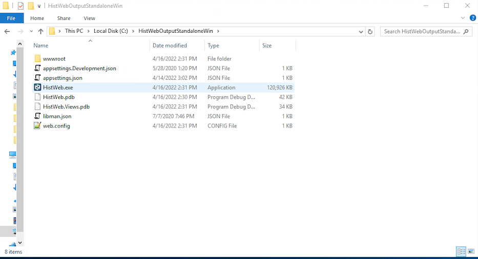
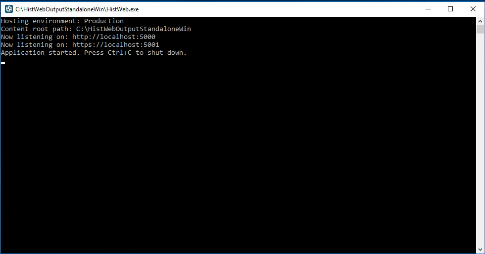
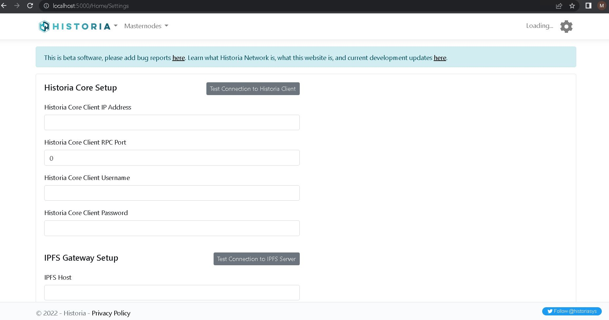
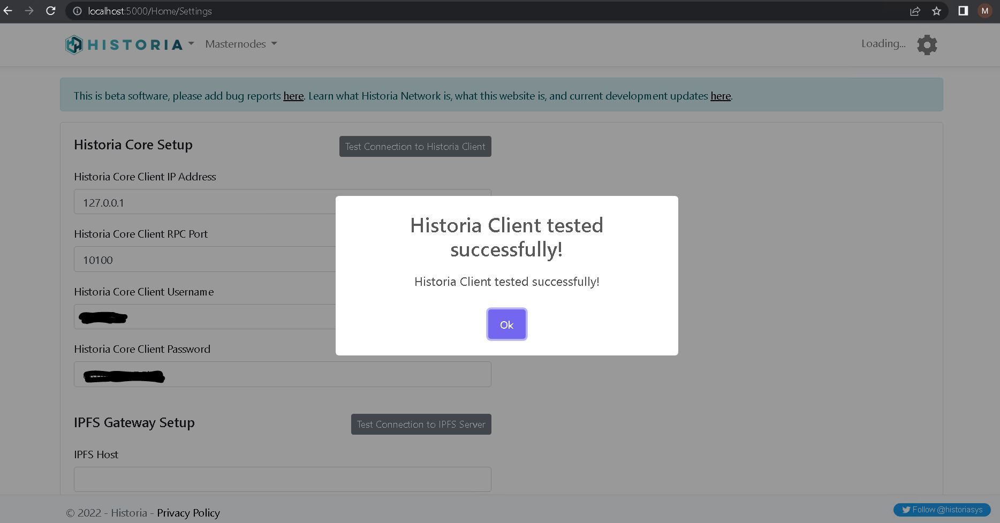
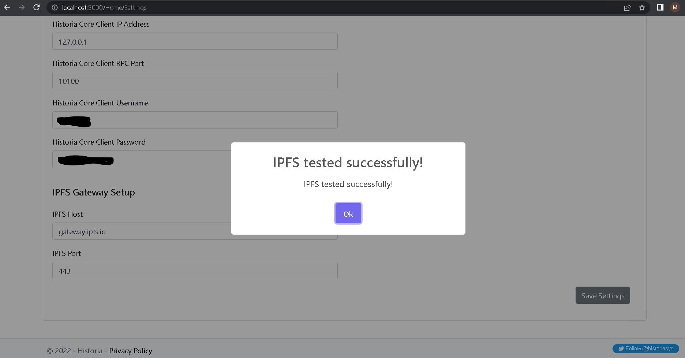
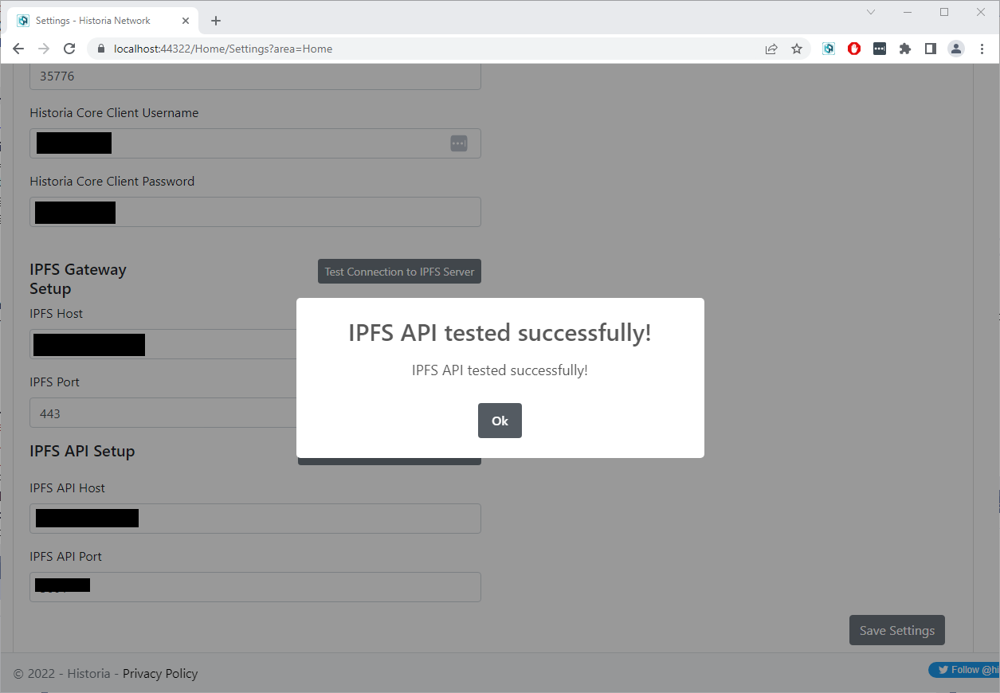
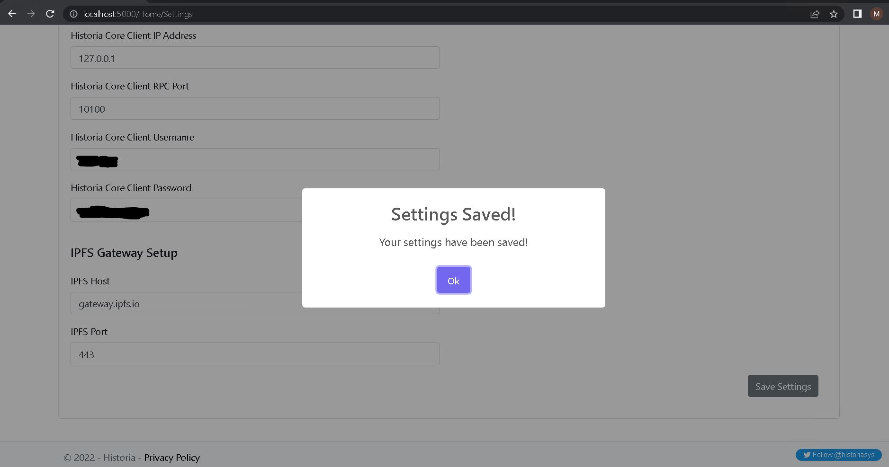
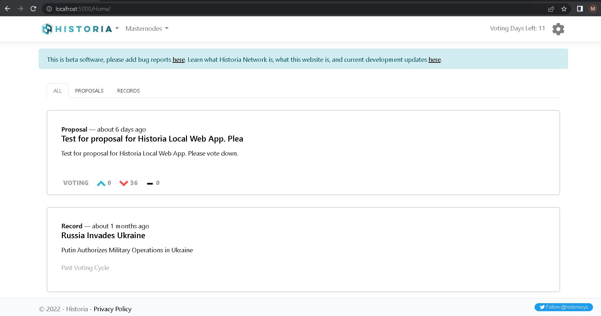

.. meta::
   :description: This guide describes how to set up the Historia Local Web App
   :keywords: historia, guide, voting nodes, setup,

.. _votingnode-setup:

==========================================
Setup the Historica Local Web Application
==========================================

Setting up a Historica Local Web App requires a basic understanding of how to use a computer, as well as an ability to follow instructions closely. 

.. raw:: html

   

      <iframe src="https://www.youtube.com/embed/n5aHiWuJI78" frameborder="0" allowfullscreen style="position: absolute; top: 0; left: 0; width: 100%; height: 100%;"></iframe>

   

Before you begin
================

This guide assumes you have already setup your voting node. You will need:

- Historia Core Wallet v0.17.0.4 or later to store your Historia. You can get this `here <https://github.com/HistoriaOffical/historia/releases/tag/0.17.0.4>`_.
- .NET Core Libary for your Operating System. You can get this `here <https://dotnet.microsoft.com/en-us/download/dotnet/3.1>`_.
- A computer running Windows, MacOS, or Linux. 

- The Historia Local Web Application Software. You can get this `here <https://github.com/HistoriaOffical/Historia-Local-Web-Application/releases/>`_.
- (Optional) A masternode or voting node previously setup if you want to use Historia Local Web App for voting. You can learn to setup a voting node  `here <https://docs.historia.network/en/latest/votingnodes/index.html>`_ or a masternode `here <https://docs.historia.network/en/latest/masternodes/index.html>`_.

In this guide, we will assume you will be working from a Windows computer. However, alternative steps for using MacOS or Linux will be indicated where necessary.

Setup the Historia Core for Local Web Application Access
========================================================

Open the Historia Core wallet config file, historia.conf. For different operating 
systems, the Historiacore folder and the historia.conf file can be found in the following locations.

+-----------+--------------------------------------------------------+--------------------------------------------+
| Platform  | Path                                                   | Shortcut                                   |
+===========+========================================================+============================================+
| Linux     | /home/yourusername/.historiacore                       | ~/.historiacore                            | 
+-----------+--------------------------------------------------------+--------------------------------------------+
| OSX       | /Macintosh HD/Library/Application Support/HistoriaCore | ~/Library/Application Support/HistoriaCore |
+-----------+--------------------------------------------------------+--------------------------------------------+
| Windows   | C:/Users/yourusername/AppData/Roaming/Historia Core    | %APPDATA%\Historia Core                    |
+-----------+--------------------------------------------------------+--------------------------------------------+

Setup RPC access in the config file
-------------------------------------

Once the historia.conf file is open add the following lines to the historia.conf config file. Make sure to choose a unique rpcuser  and rpcpassword::

  rpcuser=<YourUsername>
  rpcpassword=<YourPassword>
  rpcport=10100
  rpcthreads=8
  rpcallowip=127.0.0.1
  server=1

Save the historia.conf file, and start or restart the Historia Core Client if it is currently running.

Setup the Web Application
=========================

If you haven't already, download the Historia Local Web Application for your platform. You can get this `here
<https://github.com/HistoriaOffical/Historia-Local-Web-Application/releases/>`_.

Unzip the directory on to your desktop or location where you want it to run from. If in Linux untar instead of zip.

Open the HistWeb.exe executable by double clicking on the icon, as seen below.

If in Linux before you can run the Historia Local Web Application you must set the file to have executable permissions then to run in Linux:

::

  chmod +x HistWeb
  ./HistWeb

To run the Historia Local Web Application in OSX:

::

  dotnet HistWeb.dll

Once run the application you will see the local address in the command prompt that you need to connect to, as seen below.

Command Prompt with Local Address

Copy this address and paste it into your browser. This will open the web application in your browser. If it is your first time, it will take you to the setup screen, as seen below.

Setup Screen

Add your Historia Core Client information that you used in the historia.conf file. and click the "Test Connection to Historia Client" button. If the connection is successful you will see a Sucess message, as seen below.

Successful connection to Historia Core Client

Add IPFS gateway information with the proper port (ie 443). You can choose any IPFS gateway. Any masternode `here <https://historia.network/masternodes>`_ with IPFS/Web set with Yes/Yes can be used. Alternatively you can use gateway.ipfs.io with port 443. Click the "Test Connection to IPFS Server" button. If the connection is successful you will see a Sucess message, as seen below.

Successful connection to IPFS

Add IPFS API information with the proper port (ie 5001). You can choose any IPFS API that gives you API access. It should be noted that an open IPFS API is rare and most likely you will have to setup your own IPFS server for API access. It should also be noted that an IPFS API server is not required for voting, but it is required to create and add a new governance object. If you have setup your own masternode previously, you could open your IPFS server API port (ie 5001) via a firewall rule to your local IP address to allow for IPFS API access.  Otherwise you can setup your own IPFS API server. Follow the directions `here <https://docs.historia.network/en/latest/votingnodes/setup-ipfs-api-win.rst`_.
 

Click the "Test Connection to IPFS API Server" button. If the connection is successful you will see a Sucess message, as seen below.

Successful connection to IPFS API

Once the Historia Core Client and IPFS Gateway are setup, hit the save button to save all settings.

Successfully saving settings

The Historia Local Web Application is now setup and you can browse the proposals and records, as seen below.

If you want to use the Historia Local Web Application for voting, you have to setup your voting keys. Follow the Web App voting guide `here <https://docs.historia.network/en/latest/governance/basex.html>`_. It is the same process. 

Multiple Masternode / Voting Nodes
----------------------------------------------

You can add multiple masternodes or voting nodes and this will vote with all keys properly. The one caveat is that the passphrase you use in the web application must be the same accross all masternodes / voting nodes.

Trouble Shooting
----------------------------------------------

1. Can not connect to Historia Core Client 
   - Check to make sure Historia Core Client is running.
   - Check to make sure that your historia.conf configure file has the correct rpc settings
2. Can not connect to IPFS Gateway
   - Check to make sure you have a valid IPFS server in the settings page.
   - Check to verify the port is set properly. This is normally port 443.
3. No records or proposals are seen.
   - Make sure that the Historia Core Client is synced completely.
   - Make sure that you have a valid IPFS Gateway server.
4. Voting Issues
   - Have you added your masternode / voting nodes to Historia Local Web app? 
   - Multiple Masternodes / Voting Nodes must have all the same password.
   - Make sure you have updated your registered masternode / voting node in the Historia Local Web Application with your **VotingAddressPrivateKey**. Follow the Web App voting guide `here <https://docs.historia.network/en/latest/governance/basex.html>`_ again.

