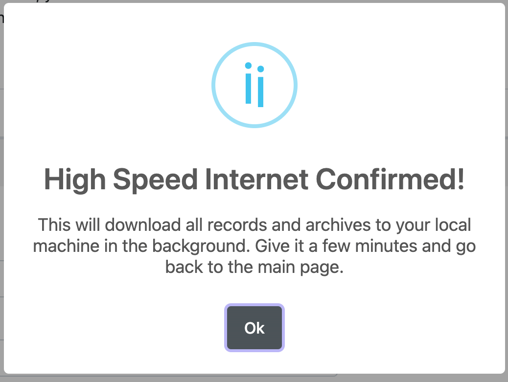
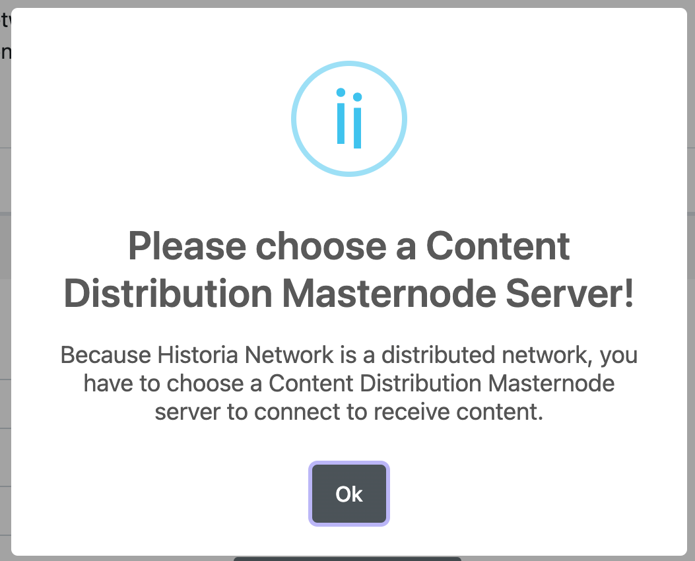

.. meta::
   :description: This guide describes how to set up the Historia Local Web App
   :keywords: historia, guide, voting nodes, setup,

.. _votingnode-setup:

==========================================
Setup the Historica Local Web Application
==========================================

Setting up a Historica Local Web App requires a basic understanding of how to use a computer, as well as an ability to follow instructions closely. 

Before you begin
================

This guide assumes you have already setup your voting node. You will need:

- Historia Core Wallet v0.17.3.0 or later to store your Historia. You can get this `here <https://github.com/HistoriaOffical/historia/releases>`_.
- A computer running Windows, MacOS, or Linux. 

In this guide, we will assume you will be working from a Windows computer. However, alternative steps for using MacOS or Linux will be indicated where necessary.

Setup the Historia Local Web Application,
========================================================

If the Historia Local Web application has not been started previously, you will need to complete the preliminary setup as shown in the following screenshots.

.. figure:: ../img/amn2.png
   :width: 600px

   Choose if you are using high-speed internet or not.

   If you choose the High Speed Internet, hit the ok button

   Hit OK and Choose Content Distribution Masternode

.. figure:: ../img/amn5.png
   :width: 600px

   Click on the table to choose a masternode and then hit the "Test & Save IPFS Server"

.. figure:: ../img/amn6.png
   :width: 300px

   This masternode is up and available. Hit the Save button.

.. figure:: ../img/amn7.png
   :width: 300px

   Preliminary Setup is complete, now you can hit the Ok button.

After the preliminary setup is complete, Historia Local Web application is now setup and ready for use.

