.. meta::
   :description: This guide describes how to set up a Historia voting node. 
   :keywords: historia, guide, voting nodes, setup,

.. _votingnode-setup:

==========================================
Setup a Voting Node
==========================================

Setting up a voting node requires a basic understanding of how to use a computer, as well as an ability to follow instructions closely. 

We have created a tutorial video which you follow along and view here

.. raw:: html

   

      <iframe src="https://www.youtube.com/embed/upYk31b-bls" frameborder="0" allowfullscreen style="position: absolute; top: 0; left: 0; width: 100%; height: 100%;"></iframe>
    

Before you begin
================

This guide assumes you are setting up a voting node for the first
time. You will need:

- 100 HTA.
- A little extra HTA for registration transactions: 1-5 HTA
- Historia Core Wallet v0.17.3.0 or later to store your Historia. You can get this here https://github.com/HistoriaOffical/historia/releases/
- A computer running Windows, MacOS, or Linux.

In this guide, we will assume you will be working from a Windows computer. However, alternative steps for using MacOS or Linux will be indicated where necessary.

Voting Node Requirements
------------------------

The Historia developers have tried to make this process as simple as possible for the users. The following requirements are required to setup a voting node.
 - Voting Node 
 
   - Collateral Requirement: 100 HTA
   - A little extra HTA for registration transactions: 1-5 HTA 
   - Internet access on home network.
   - A computer running Windows, Linux. or MacOS

In this guide, we will setup a Voting Node with collateral of 100. If you are looking to setup a Content Distribution Masternode with collateral of 5000 please see the appropriate guide for that.

Setup a Voting Node
=====================

Before you begin, please have the required HTA in your wallet. After you have the 
required HTA in your wallet you can begin to setup a Voting Node. This guide 
will describe the steps for Historia Core Wallet with full integration of the 
Historia Local Web application.

Encrypt And Backup Your Wallet
==============================

The first step is to secure your wallet (if you have not already done so). 
First, encrypt the wallet by selecting 
**Settings > Encrypt wallet**. You should use a strong, new password
that you have never used somewhere else. Take note of your password and
store it somewhere safe or you will be permanently locked out of your
wallet and lose access to your funds. Next, back up your wallet file by
selecting **File > Backup Wallet**. Save the file to a secure location
physically separate to your computer, since this will be the only way
you can access our funds if anything happens to your computer.

Setup your Masternode via the Historia Local Web application (HLWA)
===================================================================
The Historia Network Core wallet now includes full integration of the Historia Local Web application. This application facilitates the automation of voting node setup, providing all necessary functionality to streamline the process.

Before you begin, ensure you have downloaded the latest version of the Historia Network Core wallet from the release page on GitHub found here: https://github.com/HistoriaOffical/historia/releases

Verify that the Historia Network Core wallet is fully synced. Once synchronization is complete, navigate to the "Governance" tab. At the bottom of this screen, click the "Open Historia Local Web (HLWA)" button. This will launch the Historia Local Web application. 

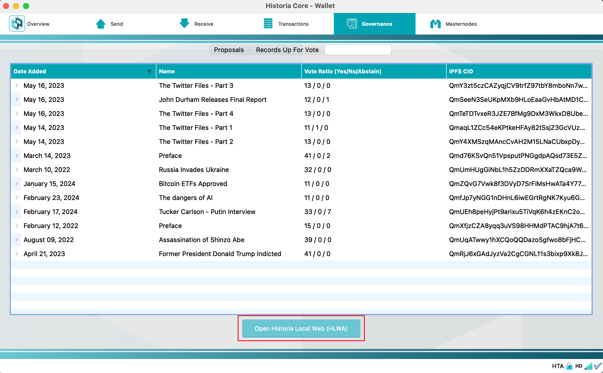

   Click the Open Historia Local Web (HLWA)

Preliminary Setup
----------------
If the Historia Local Web application has not been started previously, you will need to complete the preliminary setup as shown in the following screenshots.

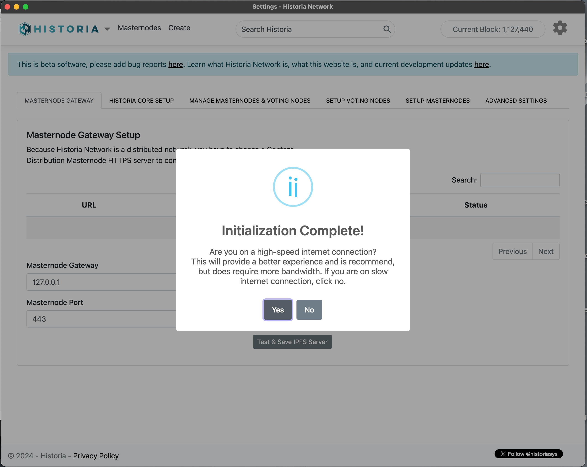

   Choose if you are using high-speed internet or not.

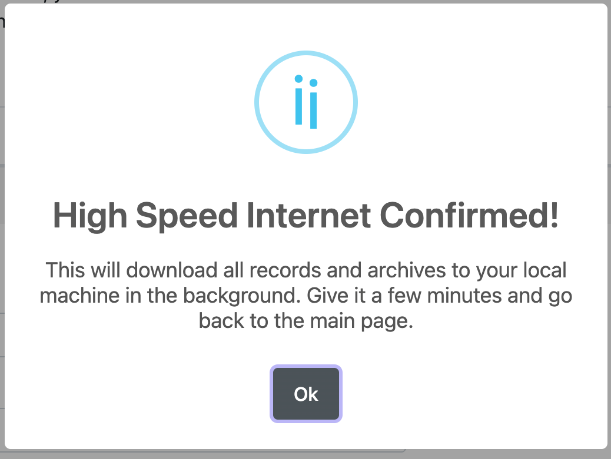

   If you choose the High Speed Internet, hit the ok button

.. figure:: ../img/amn4.png
   :width: 300px

   Hit OK and Choose Content Distribution Masternode

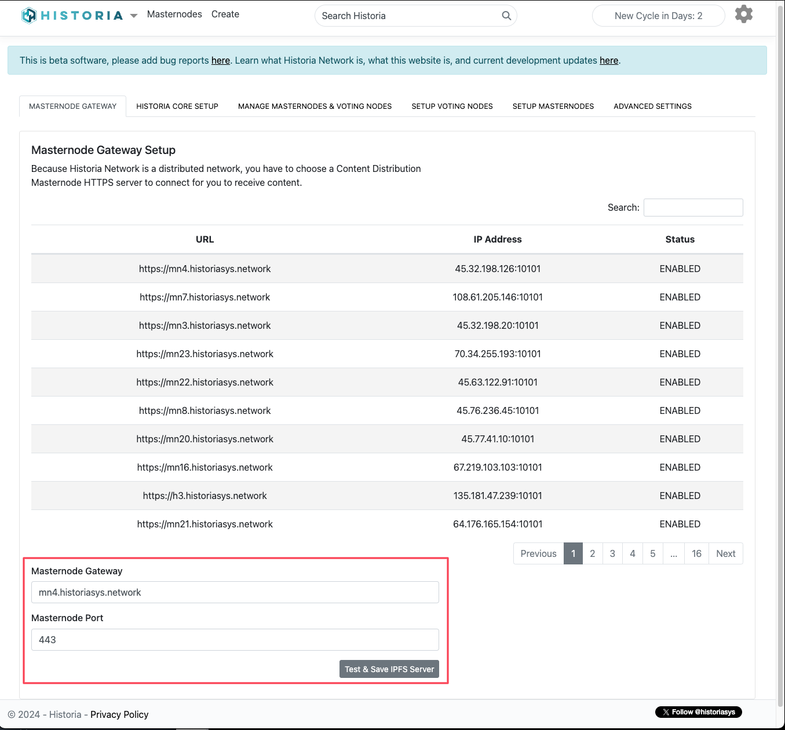

   Click on the table to choose a masternode and then hit the "Test & Save IPFS Server"

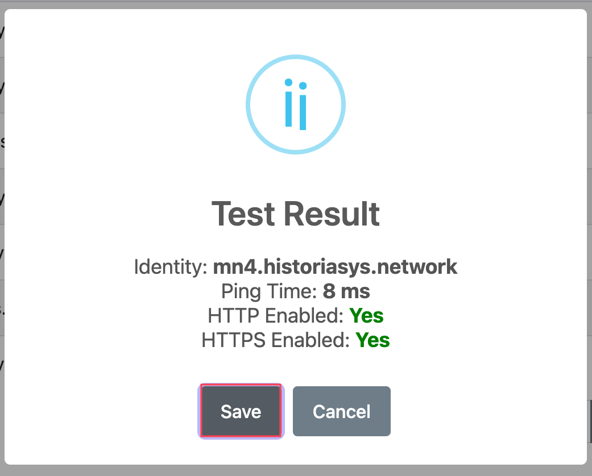

   This masternode is up and available. Hit the Save button.

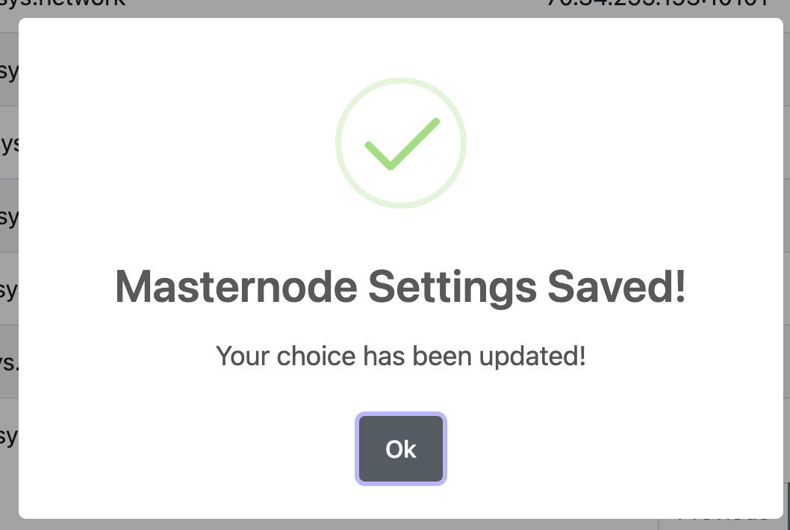

   Preliminary Setup is complete, now you can hit the Ok button.

After the preliminary setup is complete, you can now proceed to the Voting Node setup process.

Voting Node Setup
-----------------
After completing the preliminary setup, we can setup the Voting Node. Navigate to the "Setup Voting Nodes" tab and click on the Setup Voting Node.

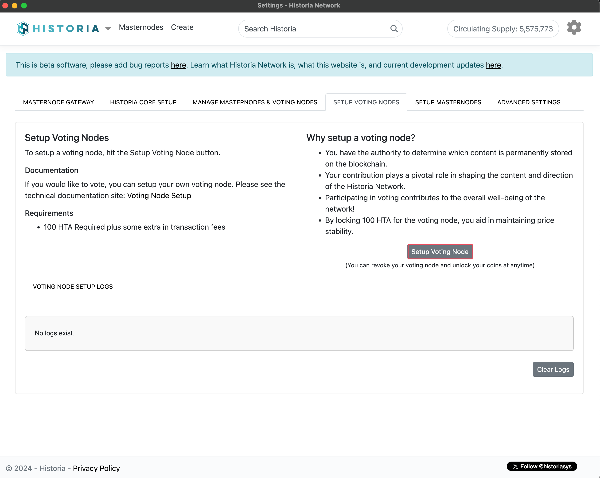

   Setup Voting Nodes tab. 

Enter your Wallet passphrase into the prompt

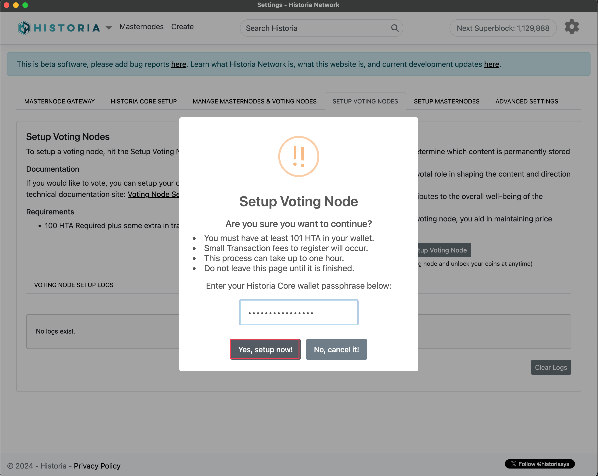

   Now Unlock your wallet to send voting node registration commands to the Historia Network.

Then you will see a notification that your Voting Node Has Been Queued for Setup, as seen in the screenshot below.

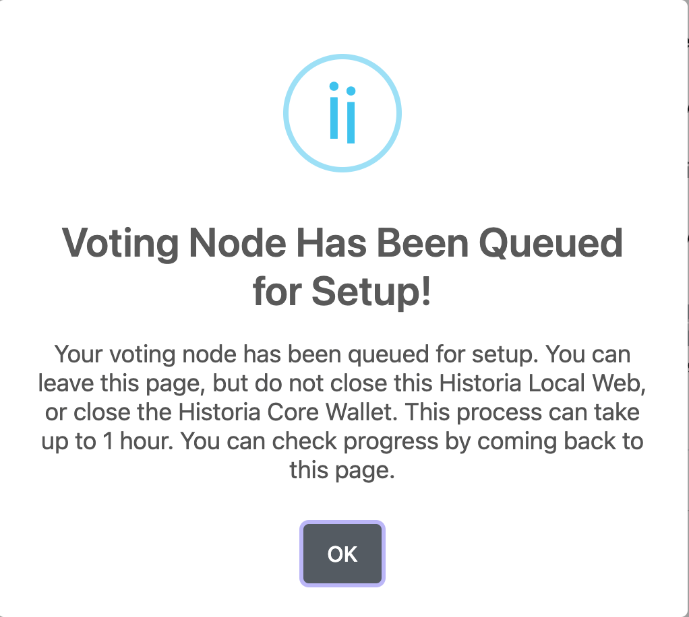

   Your voting has been queued for setup.

After about 1 hour, your voting node should be setup.

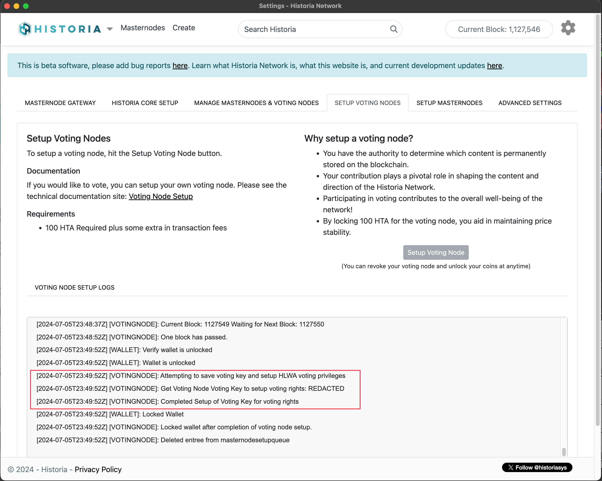

   Voting Node Logs showing successful setup.

If you go to the Manage Masternodes & Voting Nodes, you will see that a new Voting Node has been added to the screen. Your Voting Node has now been setup, and properly registered, and voting keys have been setup ready to vote.

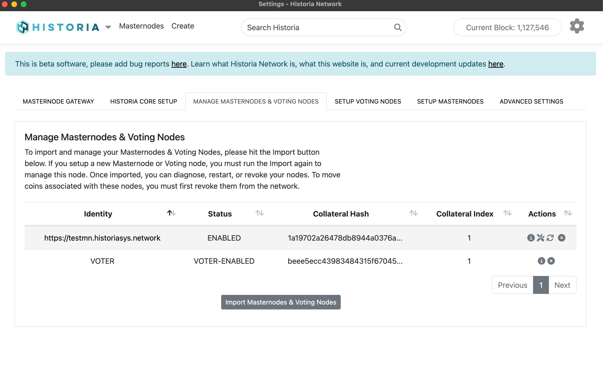

   Your Voting Node is now registered, running, and voting keys are setup.

Revoke Voting Keys
-----------------
If you no longer want to have voting privileges and have the ability to move your coins. Click the Revoke Voting Node action, and enter your wallet passphrase.

.. figure:: ../img/anv25.png
   :width: 300px

   Revoke Masternode Confirmation Dialog
